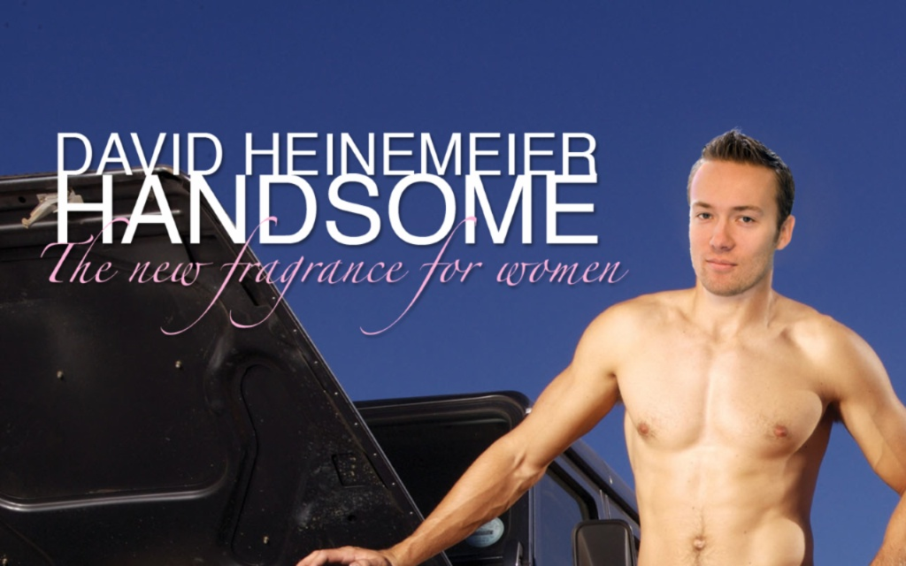

!SLIDE
# me. #

!SLIDE
# mindmatters. #

!SLIDE
# we're hiring, btw.
## talk to me please.

!SLIDE
# web applications.

!SLIDE
# a lot of them.

!SLIDE
# very short project runtime.

!SLIDE
# tight budget.

!SLIDE
# tools

!SLIDE
# get out of the way.

!SLIDE
# yak shaving is prohibited.

!SLIDE
# quick, not dirty.

!SLIDE
# impossible.

!SLIDE center transition=fade

!SLIDE 
# Rails

!SLIDE
# benefits:

!SLIDE
# abstraction.

!SLIDE
# right level of abstraction.

!SLIDE
# best practices.

!SLIDE
# DRY POLS

!SLIDE
# DRY PLS

!SLIDE code
    @@@ Ruby
    2.days.from_now

!SLIDE
# opinion!

!SLIDE
# greenfield

!SLIDE
# database backed

!SLIDE
# web applications

!SLIDE
# <del>scaling</del>
